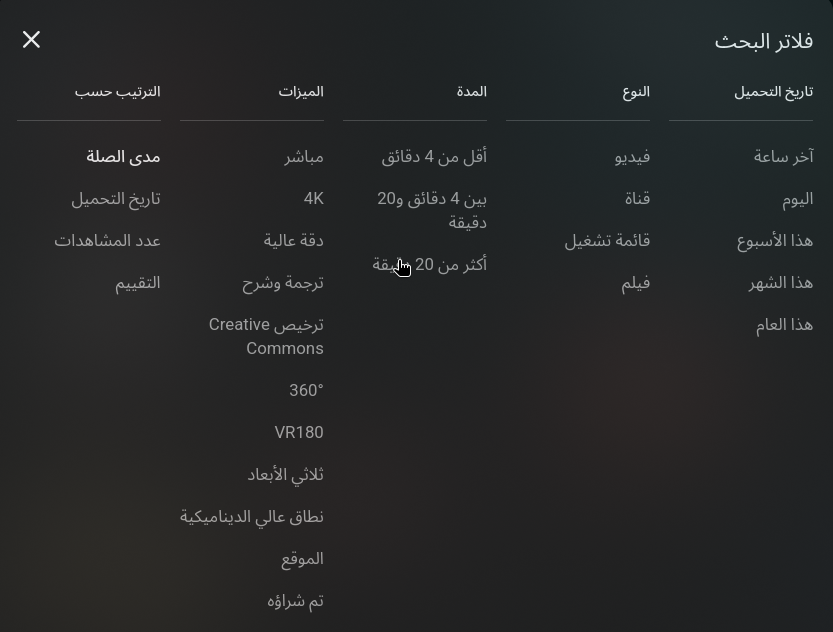

## TODO — Video & Playlist Selection Logic

### 🪄 Phase 1: Video / Playlist Selection
- [ ] Choose **one playlist _or_ one large video** per tag.  
  - Example:  
    - Playlist: 22 videos totaling **23 hours**  
    - Single video: **20 hours**, covering the same tag  
  - ➡️ Pick the **best representative source** for that tag.

---

### 🔍 Phase 2: YouTube Filtering
- [ ] Investigate using **YouTube’s built-in filters** (duration, type, etc.) to refine search results.  
  - *(e.g., filter by long videos, exclude shorts, or prioritize educational content)*  
- 

- [ ] Try to **find Arabic audio resources** if available.  

---

### ⏱️ Phase 3: Duration-Based Classification
- [ ] **Too Short** → If duration < **100 seconds**, mark as:
  - `brief`
  - or **exclude** from dataset.
- [ ] **Too Long** → If duration > **24 hours**, mark as:
  - `playlist`
  - or **aggregate source** for that tag.
